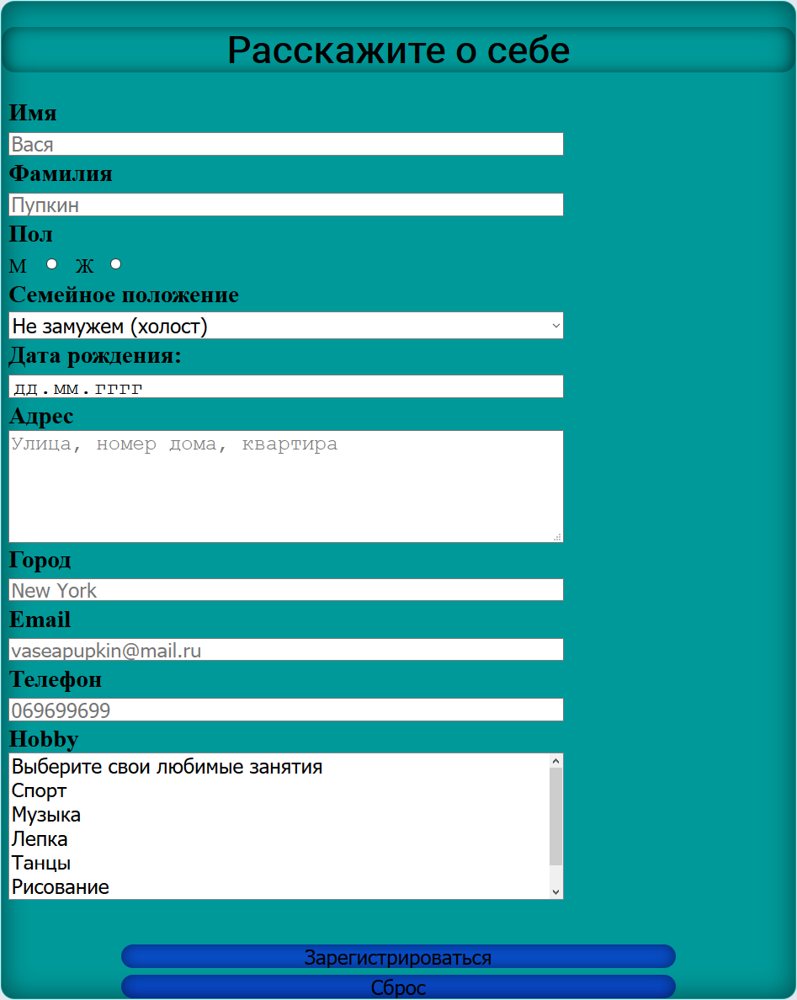

# Installation
1. Open OpenServer folder
2. Paste project in ospanel/domains/
3. Open PhpMyAdmin
4. Open SQL Tab
5. Paste Sql script from 127_0_0_1.sql file
6. Execute
7. Reload OpenServer
8. Run template.php

# ScreenShots
## Main Page

## Gallery

## Questionare

